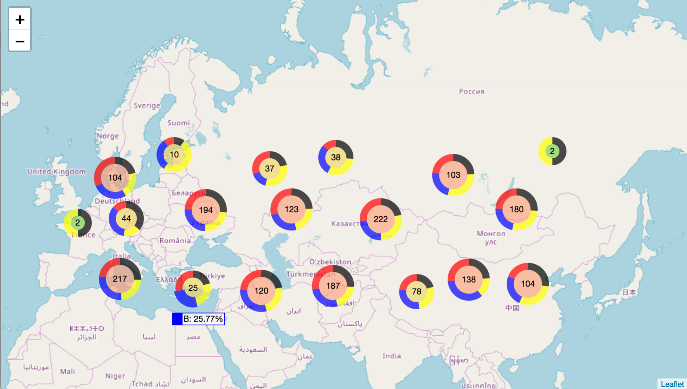

Leaflet.DonutCluster
=====================

A lightweight standalone [Leaflet](https://leafletjs.com)  plugin to display donut charts instead of circles in map when using [Leaflet marker cluster](https://github.com/Leaflet/Leaflet.markercluster). This lib copies the codes which generate the donut svg from [donutjs](https://github.com/finom/donutjs).


**Only depends on Leaflet and Leaflet.markercluster, NOT on other chart library like d3.js**

- [Online Demo -- basic](https://jsfiddle.net/b43c1xkf/1/embedded/result,html/)
- [Online Demo -- sum by field](https://jsfiddle.net/mfxd015b/1/embedded/result,html/)




## Usage
First include the Leaflet.DonutCluster.js, but you don't need to include the css file, as it's optional. if you want to include the css file, you can comment the line in the .js file. 
```javascript
text.setAttribute('style', ...)
```
Then use L.DonutCluster to create a markercluster instance.
```javascript
                //create the markercluster
                var markers = L.DonutCluster(
                    //the first parameter is  markercluster's configuration file
                    {
                        chunkedLoading: true
                    }
                    //the second parameter is  DonutCluster's configuration file
                    , {
                    key: 'title', //mandotary, indicates the grouped field, set it in the options of marker
                    sumField: 'value', // optional, indicates the value field to sum. set it in the options of marker
                    order: ['A', 'D', 'B', 'C'], // optional, indicates the group order.
                    title: ['Type A','Type D','Type B','Type C' ], // optional, indicates the group title, when it is an array, the order option must be specified. or use an object.{A:'Type A',D: 'Type D',B:'Type B',C:'Type C' }
                    arcColorDict: { // mandotary, the arc color for each group.
                        A: 'red',
                        B: 'blue',
                        C: 'yellow',
                        D: 'black'
                    }
                })
```
Then add the marker into the markercluster.
```javascript
        var marker = L.marker(L.latLng(a[0], a[1]), {
            title: title //the value to group
        });

        ...

        markers.addLayer(marker);
```

## License

MIT